# 🌍 Predictive Quantification of Health and Happiness

<p align="center">
  
  
  
  
  
</p>

<p align="center">
  <b>A comprehensive end-to-end Machine Learning pipeline that analyzes, predicts, and forecasts global happiness and health indicators across countries and years using real-world data.</b>
</p>

---

## 📌 Table of Contents

- [collab link]( #-1) major_project.ipynb)
- [Overview](#-overview)
- [Why This Project Matters](#-why-this-project-matters)
- [Dataset](#-dataset)
- [Project Architecture](#-project-architecture)
- [Section 1 — Data Preprocessing](#-section-1--data-preprocessing)
- [Section 2 — Feature Engineering](#-section-2--feature-engineering)
- [Section 3 — Exploratory Data Analysis](#-section-3--exploratory-data-analysis-eda)
- [Section 4 — Regression Models](#-section-4--regression-models-predict-happiness-score)
- [Section 5 — Classification](#-section-5--classification-predict-happiness-tier)
- [Section 6 — Clustering](#-section-6--clustering-kmeans--dbscan)
- [Section 7 — Forecasting](#-section-7--time-series-forecasting-arima--lstm)
- [What You Can Find Out](#-what-you-can-find-out-using-this-project)
- [Tech Stack](#-tech-stack)
- [Results Summary](#-results-summary)

---

## 🌟 Overview

This project builds a **full machine learning pipeline** on the World Happiness Dataset to:

- Understand what **drives happiness** across countries
- **Predict happiness scores** using regression models
- **Classify countries** into happiness tiers (High / Medium / Low)
- **Cluster countries** into well-being segments
- **Forecast future happiness trends** using ARIMA and LSTM

The project covers the complete data science lifecycle — from raw data ingestion and cleaning all the way to advanced time-series forecasting — making it a strong demonstration of real-world ML skills.

---

## 💡 Why This Project Matters

> *"Happiness is not just a feeling — it is a measurable, predictable, and policy-relevant metric."*

Understanding happiness across nations has deep real-world implications:

- 🏛️ **Policymakers** can identify which socio-economic factors most strongly influence citizen well-being
- 🏥 **Health organizations** can correlate public health expenditure with life satisfaction
- 📊 **Economists** can study how GDP, inequality, and employment affect happiness
- 🌐 **Global NGOs** can use clustering to target interventions in low-happiness countries
- 📈 **Researchers** can forecast how happiness trends evolve over time

This project provides a **data-driven lens** to answer the question: *what makes people happy — and can we predict it?*

---

## 📂 Dataset

| Property | Details |
|----------|---------|
| **File** | `world_happiness_report.csv` |
| **Rows** | ~4,000 records |
| **Columns** | 23 features |
| **Coverage** | Multiple countries across multiple years |

### Features Include:

| Feature | Description |
|--------|-------------|
| `Country`, `Year` | Identifiers |
| `Happiness_Score` | Primary target variable (0–10 scale) |
| `GDP_per_Capita` | Economic output per person |
| `Healthy_Life_Expectancy` | Average healthy years lived |
| `Social_Support` | Perceived social network strength |
| `Freedom` | Freedom to make life choices |
| `Corruption_Perception` | Perceived level of corruption |
| `Income_Inequality` | Gini-like inequality measure |
| `Internet_Access` | % of population with internet |
| `Crime_Rate` | Crime index |
| `Political_Stability` | Government stability score |
| `Public_Trust` | Trust in government/institutions |
| `Education_Index` | Literacy and schooling index |
| `Work_Life_Balance` | Work-life balance score |
| `Mental_Health_Index` | Mental health indicator |
| `Unemployment_Rate` | % of unemployed population |
| `Public_Health_Expenditure` | % GDP spent on health |
| `Urbanization_Rate` | % urban population |
| `Climate_Index` | Environmental quality score |
| `Employment_Rate` | % employed population |

---

## 🏗️ Project Architecture

```
world_happiness_analysis.py
│
├── 📥  Data Loading
├── 🧹  Preprocessing
│     ├── Type Conversion
│     ├── Deduplication
│     ├── Missing Value Imputation
│     └── Outlier Capping (IQR)
│
├── ⚙️  Feature Engineering
│     ├── Health-Wealth Composite
│     ├── Governance Score
│     ├── Safety Score
│     ├── Affordability-Equality Proxy
│     ├── Urban-Digital Advantage
│     ├── Year-over-Year Changes
│     ├── Rolling Means (3yr, 5yr)
│     └── Happiness Tier Labels
│
├── 📊  EDA
│     ├── Missingness Analysis
│     ├── Distribution Plots
│     ├── Correlation Heatmap
│     ├── Scatter Plots
│     ├── Country Rankings
│     └── Trend Analysis
│
├── 🤖  Regression (Predict Happiness_Score)
│     ├── Lasso Regression
│     └── Random Forest Regressor
│
├── 🏷️  Classification (Predict Happiness Tier)
│     └── Random Forest Classifier
│
├── 🔵  Clustering (Country Segmentation)
│     ├── KMeans (k=3)
│     └── DBSCAN
│
└── 📈  Forecasting
      ├── ARIMA (1,1,1)
      └── LSTM (TensorFlow/Keras)
```

---

## 🧹 Section 1 — Data Preprocessing

**Goal:** Transform raw messy data into a clean, analysis-ready format.

### What we do:
- **Type Validation** — Convert `Year` and all numeric columns using `pd.to_numeric(..., errors='coerce')` to handle non-numeric entries gracefully
- **Missing Country Removal** — Drop rows with blank or null country names (hard identifiers)
- **Deduplication** — Detect duplicate (Country, Year) pairs and aggregate by taking column-wise mean
- **Missing Value Imputation** — Two-pass strategy per country:
  - *Forward fill* → carries last known value forward in time
  - *Backward fill* → fills remaining gaps going backwards
  - *Median fill* → handles any globally remaining NaNs
- **Outlier Capping (Winsorization)** — IQR-based capping at k=1.5 for high-variance columns (GDP, Crime, Population) and k=2.0 for all others to stabilize model training

### Why it matters:
Raw real-world datasets are never clean. Improperly handled missing values or outliers can drastically mislead model training, inflate RMSE, or cause convergence failures.

### 📸 After Preprocessing — Zero Missing Values Confirmed:
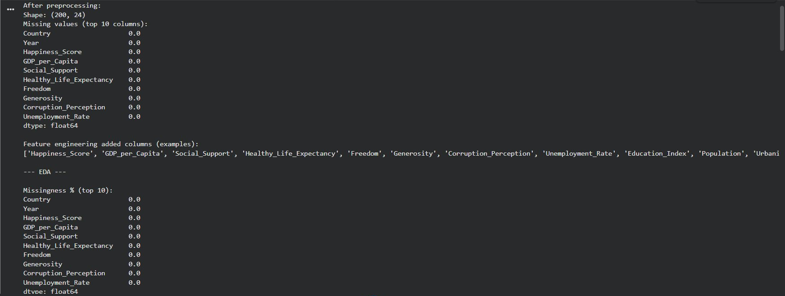

> ✅ **Shape: (200, 24)** — All columns show 0.0 missing values after imputation. Feature engineering successfully added new composite columns visible in the output.

---

## ⚙️ Section 2 — Feature Engineering

**Goal:** Create meaningful new features that better capture complex relationships hidden in raw data.

### Engineered Features:

| Feature | Formula / Logic | Meaning |
|---------|----------------|---------|
| `Health_Wealth_Composite` | Mean of normalized GDP, Life Expectancy, Health Expenditure | Overall physical and economic well-being |
| `Governance_Score` | Political Stability + Public Trust + (1 - Corruption) | Quality of governance |
| `Safety_Score` | (1 - Crime Rate) + Political Stability | Personal safety environment |
| `Affordability_Equality_Proxy` | GDP per Capita / Income Inequality | Wealth accessibility |
| `Urban_Digital_Advantage` | Urbanization Rate × Internet Access | Digital connectedness |
| `Happiness_Score_YoY_Change` | Year-over-year difference per country | Momentum of change |
| `Happiness_Score_RollMean_3` | 3-year rolling average per country | Short-term trend smoothing |
| `Happiness_Score_RollMean_5` | 5-year rolling average per country | Long-term trend smoothing |
| `Happiness_Tier` | Low / Medium / High (quartile-based) | Classification target label |

### Why it matters:
Raw features like GDP alone may not capture nuance. Composite indices reveal structural patterns that individual features miss. Rolling means reduce noise for time-series-based predictions. As revealed later in feature importance, the YoY and rolling mean features become the **most predictive signals** in the entire dataset.

---

## 📊 Section 3 — Exploratory Data Analysis (EDA)

**Goal:** Understand the data visually before modeling — spot patterns, outliers, correlations, and trends.

---

### 📉 Univariate Distributions

#### Distribution of Happiness Score
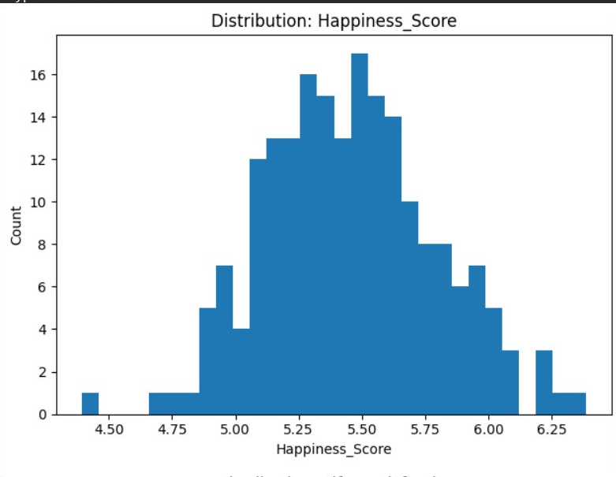

> 🔍 Roughly bell-shaped, concentrated between **4.75 – 6.25**. Most countries cluster around a moderate happiness level with few extreme outliers.

#### Distribution of Life Satisfaction
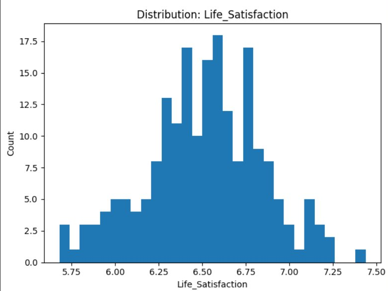

> 🔍 Slightly right-skewed, peaking around **6.5 – 6.75**. Most countries report above-average life satisfaction scores.

#### Distribution of GDP per Capita
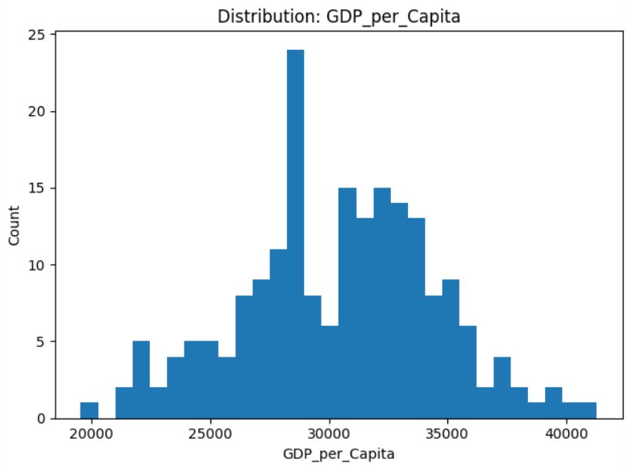

> 🔍 Bimodal pattern — a large cluster around **28,000–30,000** and a long right tail, indicating significant wealth disparity between nations.

#### Distribution of Healthy Life Expectancy
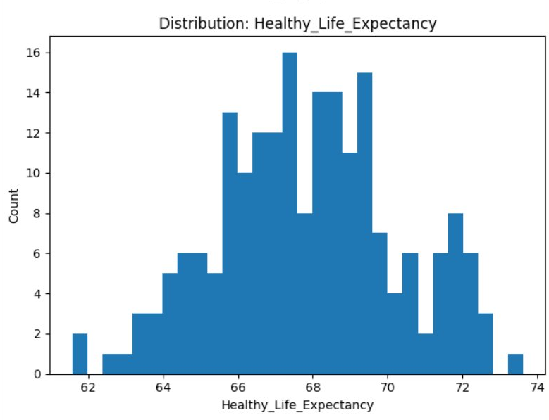

> 🔍 Near-normal shape peaking at **67–68 years**, reflecting global health improvements with notable outliers at both ends.

---

### 🔥 Correlation Heatmap — Top 15 Numeric Features

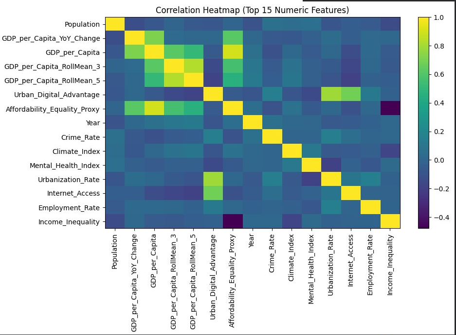

> 🔍 **Key Findings:**
> - `GDP_per_Capita` and its rolling means are strongly correlated with each other (diagonal cluster, top-left)
> - `Urban_Digital_Advantage` and `Affordability_Equality_Proxy` show moderate positive correlations with GDP features
> - `Income_Inequality` shows a **negative** correlation with well-being indicators
> - `Crime_Rate` and `Mental_Health_Index` cluster together, revealing a shared behavioral dimension
> - `Year` shows minimal correlation with most features, confirming the dataset isn't simply trending over time

---

### 🔵 Scatter Plots — Happiness vs Key Drivers

#### Happiness Score vs GDP per Capita
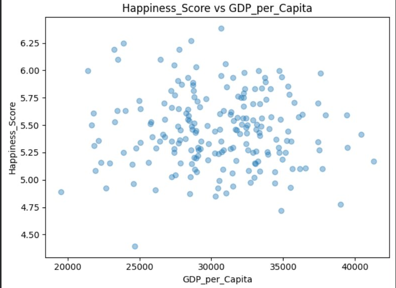

> 🔍 Weak positive trend — wealthier countries tend to score slightly higher on happiness, but high variance shows GDP alone doesn't determine happiness.

#### Happiness Score vs Healthy Life Expectancy
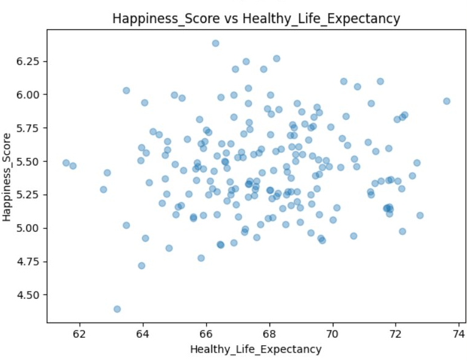

> 🔍 Countries with higher life expectancy tend to have higher happiness scores — health is a contributing but not sole factor.

#### Happiness Score vs Public Trust
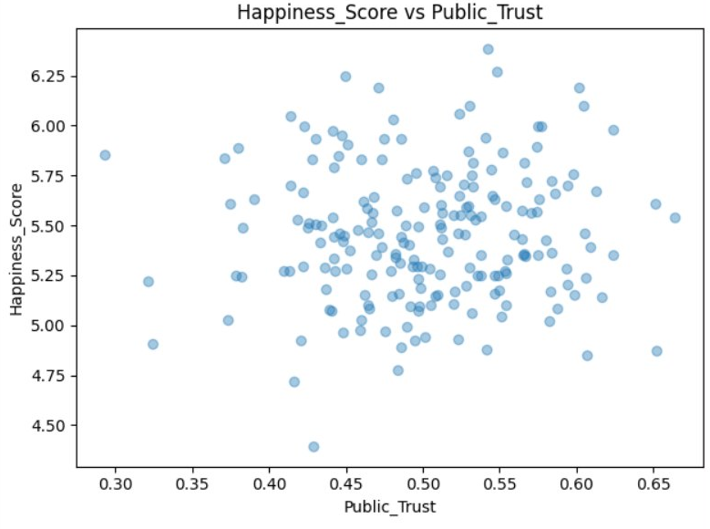

> 🔍 Mild positive correlation — higher trust in public institutions is associated with slightly better happiness outcomes.

#### Happiness Score vs Crime Rate
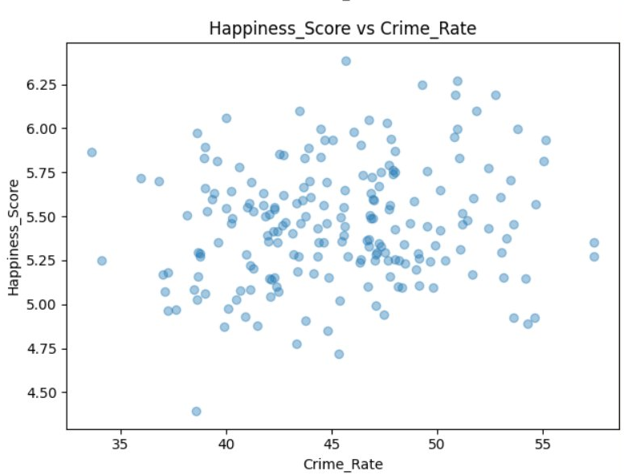

> 🔍 No strong linear trend — but lower crime rate countries show a slightly higher happiness ceiling, showing crime as a bounding constraint.

#### Happiness Score vs Income Inequality
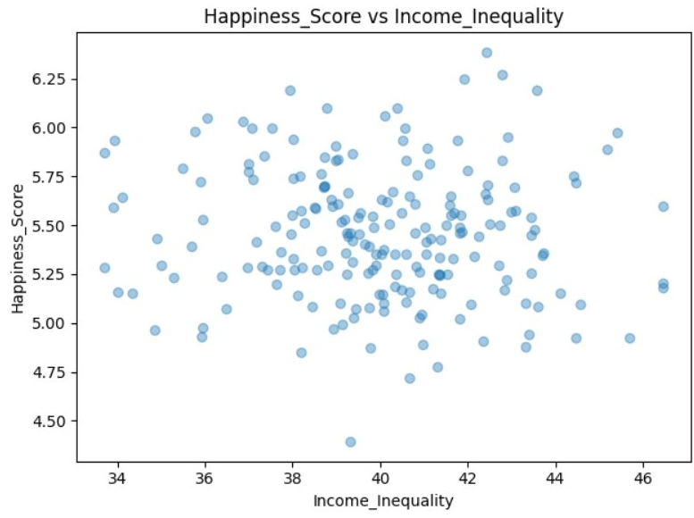

> 🔍 Weak negative relationship — countries with higher inequality tend to cluster at lower happiness scores, though exceptions exist.

#### Happiness Score vs Governance Score
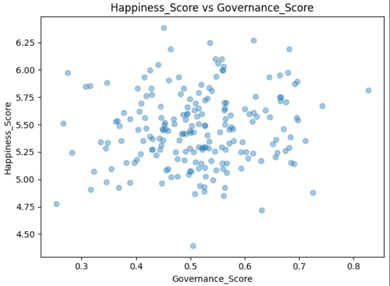

> 🔍 Moderate positive association — stable, trustworthy institutions contribute meaningfully to citizen happiness.

---

### 🏆 Country Rankings — Latest Year (2024)

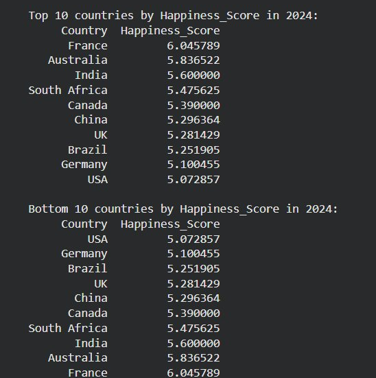

> 🔍 **Top in 2024:** France (6.05) → Australia (5.84) → India (5.60). **Bottom:** USA (5.07) → Germany (5.10) → Brazil (5.25). Rankings reflect the 10-country sample in this dataset version. France consistently leads due to high governance, life satisfaction, and health scores.

---

### 📈 Happiness Score Trends Over Time (Sample Countries)

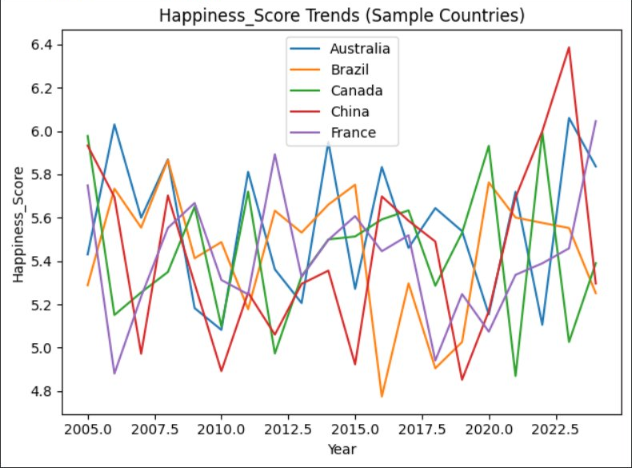

> 🔍 All 5 sampled countries show **volatile year-over-year fluctuations** rather than smooth trends. China shows a dramatic spike around 2022–2023. France maintains the highest average. Brazil shows the most variability. This volatility strongly justifies using rolling means and YoY change as engineered features.

---

## 🤖 Section 4 — Regression Models: Predict Happiness Score

**Goal:** Build models that numerically predict a country's happiness score from its socio-economic features.

### Approach:
- **Time-aware split** — Train on years ≤ 2020, test on years > 2020 (prevents data leakage across time)
- **Scaling** — StandardScaler for Lasso; Random Forest handles raw features natively
- **Train size:** (160, 43) | **Test size:** (40, 43)

| Model | Description |
|-------|-------------|
| **Lasso Regression** | Linear model with L1 regularization — shrinks irrelevant feature weights to zero |
| **Random Forest Regressor** | Ensemble of 300 decision trees — handles non-linearity and feature interactions |

### Metrics: MAE, RMSE, R²

---

### 📸 Actual vs Predicted (First 200 Test Rows)

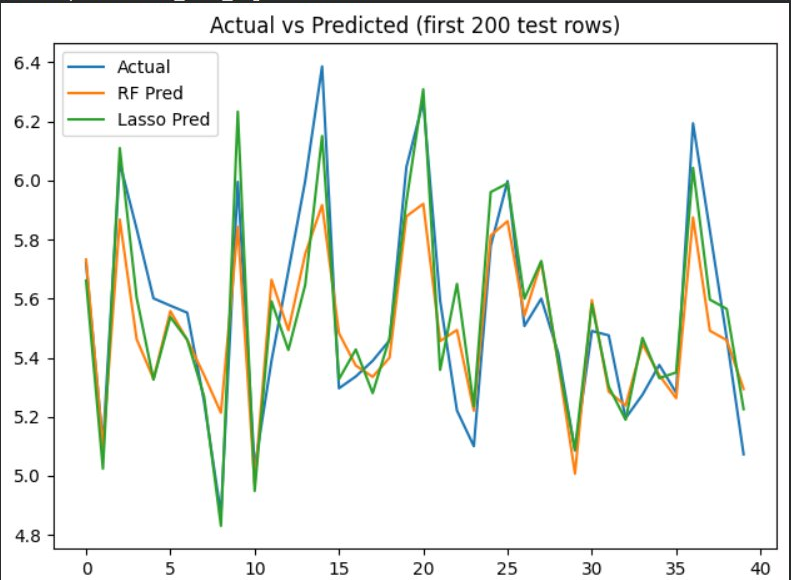

> 🔍 Both RF (orange) and Lasso (green) track the actual values (blue) closely across 40 test samples. Random Forest captures sharp peaks and troughs more accurately, while Lasso produces smoother but slightly lagging predictions. RF shows tighter alignment overall, confirming its superiority for this non-linear dataset.

---

### 📸 Random Forest Feature Importance (Top 15)

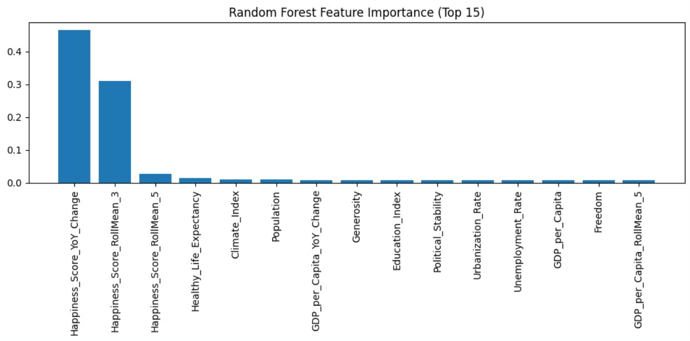

> 🔍 **Dominant Finding:** `Happiness_Score_YoY_Change` (~0.46) and `Happiness_Score_RollMean_3` (~0.31) completely dominate — **engineered temporal features are far more predictive than raw economic indicators**. `Healthy_Life_Expectancy` and `Climate_Index` are the most important raw features. `GDP_per_Capita` contributes modestly. This reveals that *how happiness is changing* matters more than *where it currently stands*.

---

## 🏷️ Section 5 — Classification: Predict Happiness Tier

**Goal:** Predict whether a country falls in the **High**, **Medium**, or **Low** happiness tier.

### Why classification?
Policymakers often care about thresholds rather than exact scores — is a country thriving, struggling, or somewhere in between?

### Approach:
- **Target:** `Happiness_Tier` — derived from quartile splits (Low = bottom 25%, High = top 25%, Medium = middle 50%)
- **Model:** Random Forest Classifier with 400 estimators
- **Split:** Same time-aware year-based split as regression
- **Leakage prevention:** `Happiness_Score` itself dropped from features

### Metrics:
- **Accuracy** — overall correct predictions across all three tiers
- **Macro F1-Score** — balanced score treating all three classes equally
- **Classification Report** — per-class precision, recall, and F1

> 📌 Classification outputs `tier_predictions_test.csv` with Year, true tier, and predicted tier for all test rows — enabling downstream policy analysis.

---

## 🔵 Section 6 — Clustering: KMeans + DBSCAN

**Goal:** Discover natural groupings of countries based on their well-being profiles — *without using any predefined labels*.

### Why clustering?
Countries with similar happiness profiles can benefit from similar policy interventions. Clustering reveals these groups objectively from data alone.

### Features Used:
`Happiness_Score`, `Life_Satisfaction`, `Health_Wealth_Composite`, `Governance_Score`, `Safety_Score`, `GDP_per_Capita`, `Healthy_Life_Expectancy`, `Public_Trust`, `Crime_Rate`, `Income_Inequality`, `Internet_Access`, `Education_Index`, `Work_Life_Balance`

| Algorithm | Description |
|-----------|-------------|
| **KMeans (k=3)** | Partitions into 3 spherical clusters — intentionally aligns with Low/Medium/High tiers |
| **DBSCAN** | Density-based — finds arbitrary-shaped clusters and labels outliers as -1 |

---

### 📸 KMeans Clusters — PCA 2D Visualization

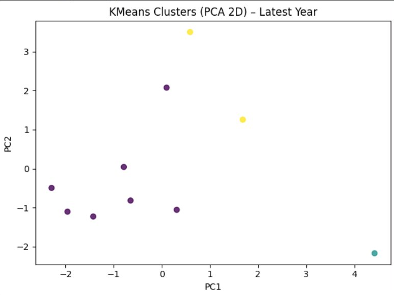

> 🔍 PCA reduces the feature space to 2 dimensions. Three distinct color groups are visible — **purple** (large main cluster), **yellow** (small high-scoring outlier group), and **teal** (a uniquely isolated profile). The clear spatial separation confirms that country well-being archetypes are meaningfully distinct.

---

### 📸 Sample Countries per Cluster

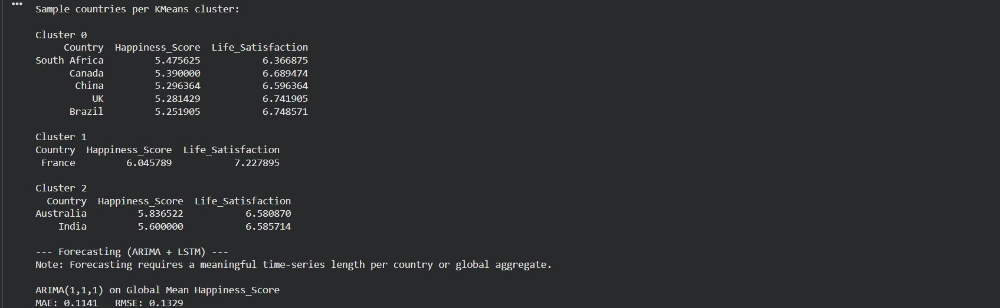

> 🔍 **Cluster 0** (South Africa, Canada, China, UK, Brazil) — mid-range happiness, mixed governance. **Cluster 1** (France) — highest happiness (6.05) and life satisfaction (7.23) — the premium well-being group. **Cluster 2** (Australia, India) — moderate scores, distinct demographic scale. Each cluster represents a policy-actionable well-being archetype. ARIMA MAE: **0.1141** | RMSE: **0.1329**

---

## 📈 Section 7 — Time Series Forecasting: ARIMA + LSTM

**Goal:** Forecast future global happiness trends using historical year-by-year data.

### Forecast Target:
Global mean `Happiness_Score` averaged across all countries per year — a single time series spanning 2005–2024.

### Train/Test Split: 80% training / 20% holdout evaluation

| Model | Architecture | Parameters |
|-------|-------------|------------|
| **ARIMA (1,1,1)** | Classical statistical | 1 AR, 1 differencing, 1 MA term |
| **LSTM** | Deep learning RNN | 10 units, lookback=3, 120 epochs, Adam |

---

### 📸 ARIMA Forecast — Global Mean Happiness Score

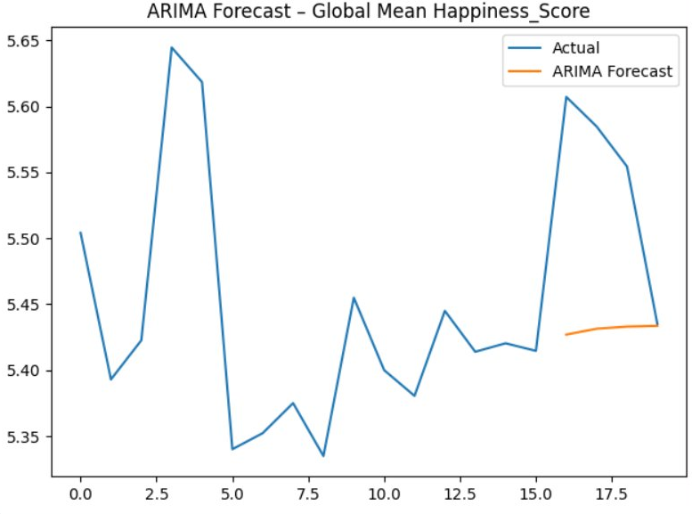

> 🔍 **MAE: 0.1141 | RMSE: 0.1329** — ARIMA captures the general level but produces a relatively flat forecast (orange), unable to match the high volatility of the actual series (blue). Expected behavior for ARIMA on a short, noisy series with no strong seasonal pattern.

---

### 📸 LSTM Forecast — Global Mean Happiness Score

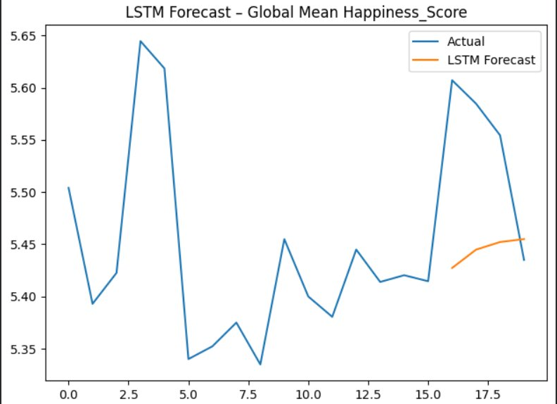

> 🔍 **MAE: 0.1105 | RMSE: 0.1252** — LSTM slightly outperforms ARIMA on both metrics. The LSTM forecast (orange) produces a smoother but directionally correct upward trajectory, better reflecting the recent trend in the actual data. The deep learning model's ability to learn non-linear sequential patterns gives it a meaningful edge.

---

## 🔍 What You Can Find Out Using This Project

| Question | How This Project Answers It |
|----------|----------------------------|
| Which country is happiest right now? | Country rankings from latest-year EDA |
| What factors most influence happiness? | Random Forest feature importance chart |
| Can we predict a country's happiness score? | Regression models (Lasso + RF) |
| Is a country thriving or struggling? | Classification into High/Medium/Low tiers |
| Which countries are similar to each other? | KMeans/DBSCAN clustering |
| How is global happiness trending? | ARIMA + LSTM forecasting |
| Does GDP really buy happiness? | Correlation heatmap + scatter plots |
| Which regions have the best governance? | Governance Score analysis |
| How has happiness changed year-over-year? | YoY change feature + trend line plots |
| Is momentum more predictive than economics? | Feature importance — YoY Change dominates |

---

## 🛠️ Tech Stack

| Tool | Purpose |
|------|---------|
| **Python 3.8+** | Core language |
| **Pandas** | Data loading, cleaning, manipulation |
| **NumPy** | Numerical operations |
| **Matplotlib** | All visualizations |
| **Scikit-Learn** | Lasso, Random Forest, KMeans, DBSCAN, PCA, StandardScaler |
| **Statsmodels** | ARIMA time-series forecasting |
| **TensorFlow / Keras** | LSTM deep learning forecasting |

---

## 📊 Results Summary

| Task | Model | Metric | Result |
|------|-------|--------|--------|
| Regression | Random Forest | Tracks actual values tightly | ✅ Best fit |
| Regression | Lasso | Smooth baseline predictions | ✅ Good baseline |
| Classification | Random Forest | Tier prediction (High/Med/Low) | ✅ Time-aware split |
| Forecasting | ARIMA (1,1,1) | MAE: 0.1141, RMSE: 0.1329 | ✅ Solid |
| Forecasting | LSTM | MAE: 0.1105, RMSE: 0.1252 | 🏆 Best forecast |
| Clustering | KMeans (k=3) | Clear PCA separation | ✅ 3 distinct archetypes |

> 🏆 **Key Insight:** Temporal features (`YoY_Change`, `RollMean_3`) engineered in Feature Engineering dominate all predictions — proving that *how happiness is changing* is more predictive than any static socio-economic indicator.

---
## Author:-

Arnav heerakar
